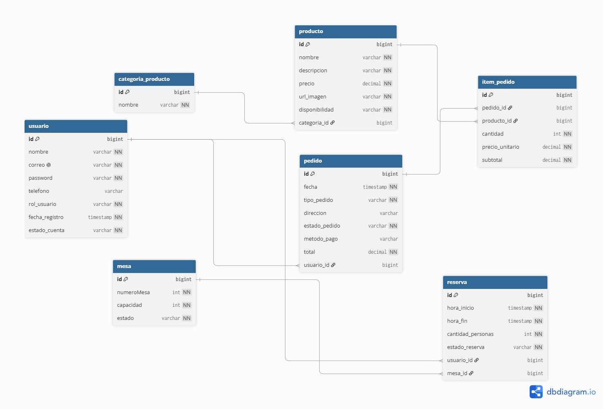

# JFRestaurantSistem

Plataforma web para gestión y reservas de restaurantes: menú digital,
pedidos a domicilio, reserva de mesas, reseñas y panel de administración.

## Estado del proyecto
🚧 En desarrollo

### Completado
- ✅ Configuración inicial y conexión a PostgreSQL
- ✅ Entidad Usuario, Rol y EstadoUsuario
- ✅ Autenticación con Spring Security + JWT (registro y login)
- ✅ Menú: CRUD de productos y categorías, con rutas protegidas por rol
- ✅ Pedidos: creación, historial, cambio de estado, cancelación, listado admin
- ✅ Reservas y Mesas: creación con validación de solapamiento, liberación automática por tiempo, cancelación, listado admin
- ✅ Manejo global de excepciones personalizadas

### En progreso / pendiente
- ⏳ Reseñas
- ⏳ Panel de administración completo
- ⏳ Frontend

## Stack
- Backend: Java 25, Spring Boot 4, Spring Security, JWT, PostgreSQL
- Frontend: HTML5, CSS3, JavaScript (pendiente)

## Estructura del repositorio
```
JFRestaurantSistem/
├── backend/     ← API REST en Spring Boot
└── frontend/    ← (pendiente)
```

## Modelo de datos
