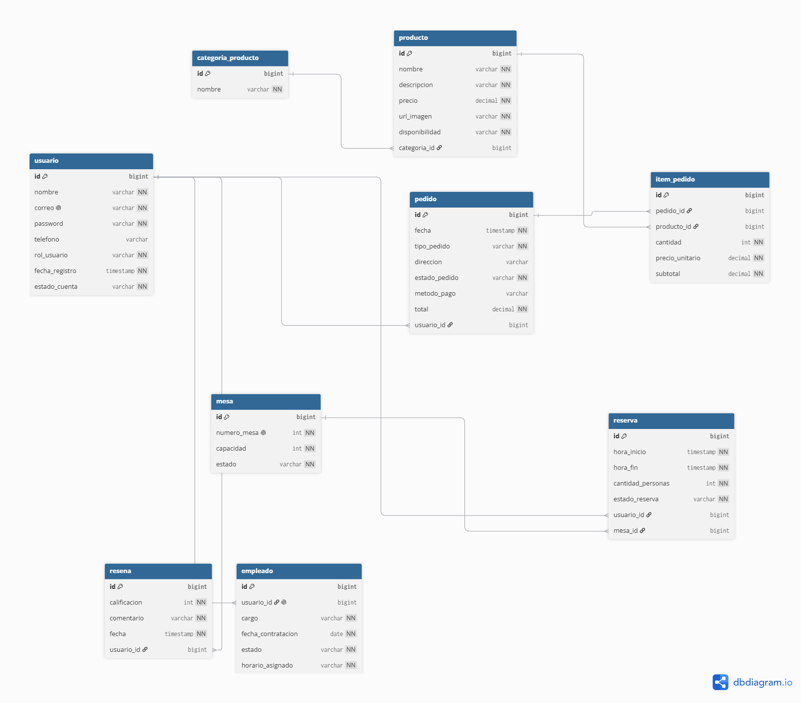

# JFRestaurantSistem

Plataforma web para gestión y reservas de restaurantes: menú digital,
pedidos a domicilio, reserva de mesas, reseñas y panel de administración.

## Estado del proyecto
🚧 Backend completo — Frontend en desarrollo

### Completado
- ✅ Configuración inicial y conexión a PostgreSQL
- ✅ Entidad Usuario, Rol y EstadoUsuario
- ✅ Autenticación con Spring Security + JWT (registro y login)
- ✅ Menú: CRUD de productos y categorías, con rutas protegidas por rol
- ✅ Pedidos: creación, historial, cambio de estado, cancelación, listado admin
- ✅ Reservas y Mesas: creación con validación de solapamiento, liberación automática por tiempo, cancelación, listado admin
- ✅ Reseñas: calificación de 1 a 5, comentario, listado paginado, promedio general
- ✅ Empleados: CRUD para el panel de administración (cargo, fecha de contratación, horario, estado)
- ✅ Manejo global de excepciones personalizadas
- ✅ Documentación interactiva con Swagger / OpenAPI

### En progreso / pendiente
- ⏳ Panel de administración (frontend)
- ⏳ Frontend completo
- ⏳ Despliegue en la nube

## Stack
- Backend: Java 25, Spring Boot 4, Spring Security, JWT, PostgreSQL
- Documentación: Swagger / OpenAPI
- Frontend: HTML5, CSS3, JavaScript (pendiente)

## Estructura del repositorio
```
JFRestaurantSistem/
├── backend/ ← API REST en Spring Boot
├── frontend/ ← (pendiente)
└── docs/
├── diagrama-er.png
└── postman/
└── JFRestaurant API.postman_collection.json
```

## Modelo de datos


## Configuración local

Este proyecto usa variables de entorno para las credenciales. Antes de correrlo, configura en tu IDE (o en tu sistema):
- `DB_URL` — URL de conexión a PostgreSQL, ej. `jdbc:postgresql://localhost:5432/tu_bd`
- `DB_USERNAME` — usuario de PostgreSQL
- `DB_PASSWORD` — contraseña de PostgreSQL
- `JWT_SECRET` — clave aleatoria de al menos 32 caracteres (genera una con `openssl rand -base64 32`)

Puedes usar `backend/src/main/resources/application.properties.example` como referencia.

## Probar la API
- **Swagger UI**: `http://localhost:8080/swagger-ui/index.html` (con el backend corriendo)
- **Colección de Postman**: `docs/postman/JFRestaurant API.postman_collection.json`

